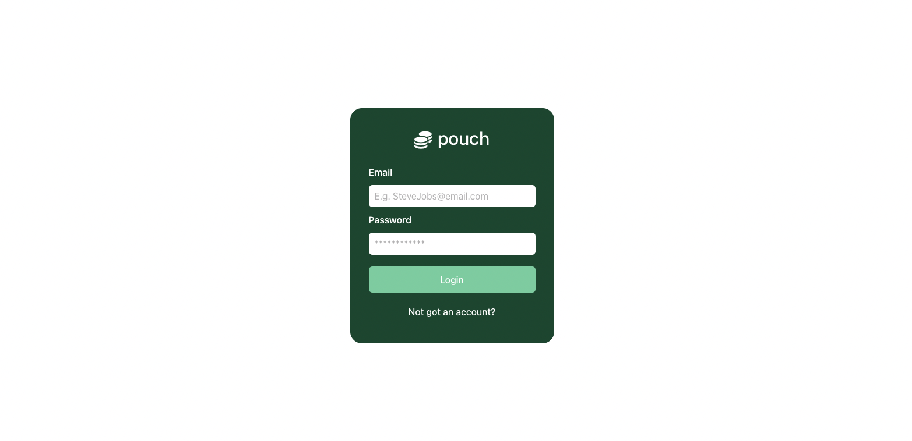
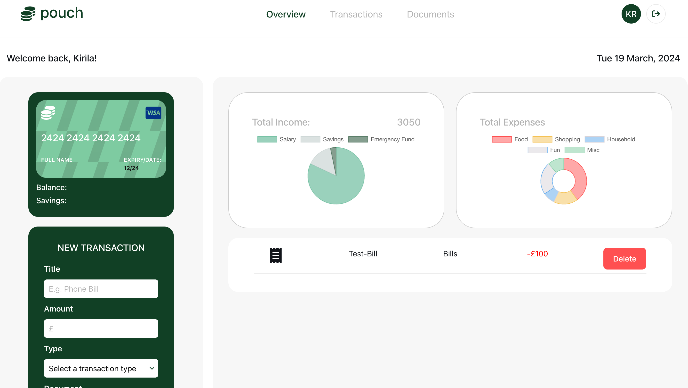

# Pouch-Finance-Tracker

## Description

The Pouch-Finance-Tracker is a web application designed to help individuals manage their finances effectively. Built using React, this app provides users with a convenient platform to track their Income, Expenses, Savings, and Transactions.

Pouch aims to empower users to take control of their finances, make informed decisions, and achieve their financial goals. By providing intuitive features, insightful analytics, and user-friendly interfaces, the app serves as a valuable tool for individuals seeking to improve their financial well-being.

Link to the deployed project: https://pouch-finance-tracker.netlify.app/

When opened the app a sign-in window is shown:

When you sign in, you will be directed to the overview page of the project:

## Key Features

1. User Authentication -

Secure user authentication system allows users to create accounts and log in securely.

2. Dashboard Overview -

Upon logging in, users are greeted with a comprehensive dashboard overview of their financial status.
The dashboard displays key financial metrics such as total income, total expenses, savings, and net worth.
Graphical representations, such as graphs, provide visual insights into spending patterns and trends.

3. Expense Tracking -

Users can easily record and categorize their expenses, enabling them to monitor where their money is being spent.

4. Data Visualization -

Interactive charts and graphs provide users with clear visual representations of their financial data.
Visualization tools help users identify spending trends, patterns, and areas for potential savings, empowering them to make informed financial decisions.

## Usage

1. Visit the deployed project at [Pouch-Finance-Tracker.](https://pouch-finance-tracker.netlify.app/).
2. If you're a new user, click on the "Not got an account?" link to create an account. If you're an existing user, proceed to step 3.
3. Enter your credentials and click on the "Sign In" button.
4. Once logged in, you'll be directed to the overview page where you can view your financial dashboard.
5. Start by exploring the various sections such as salary, expenses, card details, uploaded documents, savings, and transactions.
6. You can fill out your card details.
7. To record a transaction, find the "New Transaction" form and fill in the necessary details.
8. You can find your Transaction record on the Transaction page.
9. Use the data visualization tools to gain insights into your spending habits and financial status.
10. Make informed decisions based on the graph analytics provided to improve your financial well-being.

## Technologies Used

Frontend: React, React Router, Bootstrap for styling, Chart.js for data visualization.
Backend: Node.js, Firebase - Firestore for database storage and Authentication for Users set-up.
Deployment: Deployed on platform Netlify.

## License

Please refer to the LICENSE in the repo.
